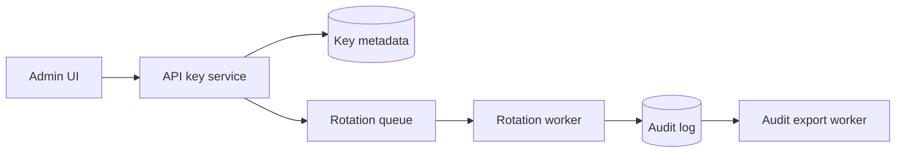

# Large PR Description Example

This is a concrete example to study and adapt, not a template to paste.

change mix: **38%&nbsp;implementation** (1,240 of 3,260 changed lines)

  

Adds organization-wide API key rotation with audit export across shared API contracts, database migrations, background workers, service authorization, and the admin UI. GitHub checks are currently passing; start with the API contracts and migration, while customer-facing enablement remains gated on rollout validation.

> [!IMPORTANT]
> Review should start with the shared API and migration contracts. The UI is useful for end-to-end context, but the irreversible behavior lives in the service, worker, and schema changes.

## Dependencies And Rollout Gates

| Dependency | Status | Why this PR depends on it |
| --- | --- | --- |
| [`docs/contracts/audit-events.md`](https://github.com/example-org/example-repo/pull/123/files#diff-724f3b0a58b4aa8fa4499564e5ec956d1c6dd1b992fbd944c84bffff63da9038) | Ready | Defines the append-only event names consumed by the export worker. |
| [`docs/runbooks/api-key-rotation.md`](https://github.com/example-org/example-repo/pull/123/files#diff-717a91555fd224b5ec7fd0b396b7f276cf0b86973460eebf91058a332ee29412) | Ready | Required rollout artifact for staged enablement and rollback. |
| [`docs/runbooks/api-key-rotation.md#staged-rollout-window`](https://github.com/example-org/example-repo/pull/123/files#diff-717a91555fd224b5ec7fd0b396b7f276cf0b86973460eebf91058a332ee29412) | Scheduled | Customer-facing enablement waits for staged validation after review. |

## Review Path

1. **Contracts and migration:** public API shape, persisted state, uniqueness, soft-delete, and rollback safety
   - [`libs/contracts/src/apiKeys.ts`](https://github.com/example-org/example-repo/pull/123/files#diff-42cf222024e02e5c57e591b3d5e542e85fa95af00fe899284f42f8b5019a115c)
   - [`db/migrations/20260430_api_key_rotation.sql`](https://github.com/example-org/example-repo/pull/123/files#diff-bd2687009282a6549160d43d12fc767247f10b6bbfb0fcd452d6b8a8a0609558)
2. **Service and authorization:** permission checks, tenant scoping, idempotency, and error contracts
   - [`services/api/src/keyRotation`](https://github.com/example-org/example-repo/pull/123/files#diff-8d3e367ed98ba8f5eee7bf188f869009a6591b5120712c14174e00720a860089)
   - [`services/api/src/authorization`](https://github.com/example-org/example-repo/pull/123/files#diff-60c885785fad62dee87bfe2a4928bcc10a827fb9214a0e5303e88cbac3afb000)
3. **Workers:** queue semantics, retry behavior, event ordering, and export completeness
   - [`workers/key-rotation/src`](https://github.com/example-org/example-repo/pull/123/files#diff-9640c694c2ae09a0398d9eefab5835dddee32a1648f434b16e220ab6b5da9e5b)
   - [`workers/audit-export/src`](https://github.com/example-org/example-repo/pull/123/files#diff-3dd28f97af4a408fbf4efba6a7aaf03d5ca9ad719897c4fd71098a4706f3a9a0)
4. **Admin UI:** operator flow, disabled states, confirmation copy, and audit visibility
   - [`web/admin/src/features/api-keys`](https://github.com/example-org/example-repo/pull/123/files#diff-8bd68585c65c14104a932e68b14d68bf43526eba40df1fbe6de58b4135081bdf)
5. **Runbook and tests:** operational handoff and regression coverage
   - [`docs/runbooks/api-key-rotation.md`](https://github.com/example-org/example-repo/pull/123/files#diff-717a91555fd224b5ec7fd0b396b7f276cf0b86973460eebf91058a332ee29412)
   - [`integration-tests/api-key-rotation.test.ts`](https://github.com/example-org/example-repo/pull/123/files#diff-08e7b9e4a4bca9a70489b5eaeeea8fa5329b11a553371b58ee17a9d08227e77d)

## Architecture And Contracts

| Boundary | Contract |
| --- | --- |
| API request | Rotation requests require organization-admin permission, a target key ID, and an idempotency key. |
| Persistence | Key material is never re-readable; only hashed key fingerprints, state, actor, and timestamps are stored. |
| Worker lifecycle | Rotation jobs are retryable until the key reaches `active`, `failed`, or `cancelled`. |
| Audit export | Audit export reads append-only events and never derives state from mutable key rows. |

## Changes

- **Shared contracts:** adds rotation request/response schemas, audit event names, and export filters in [`libs/contracts/src/apiKeys.ts`](https://github.com/example-org/example-repo/pull/123/files#diff-42cf222024e02e5c57e591b3d5e542e85fa95af00fe899284f42f8b5019a115c).
- **Database state:** adds key rotation state, actor metadata, idempotency records, and migration rollback notes in [`db/migrations/20260430_api_key_rotation.sql`](https://github.com/example-org/example-repo/pull/123/files#diff-bd2687009282a6549160d43d12fc767247f10b6bbfb0fcd452d6b8a8a0609558).
- **Service behavior:** enforces tenant-scoped permissions, prevents concurrent rotations for the same key, and writes append-only audit events.
- **Workers:** processes rotation jobs, records retryable failures, finalizes state transitions, and streams audit events into export files.
- **Admin UI:** adds rotation actions, confirmation copy, current state, disabled states, and audit export affordances.
- **Runbook and tests:** documents staged rollout/rollback and covers permission, idempotency, retry, and export behavior.

## Verification

- GitHub checks are passing.
- `pnpm format && pnpm typecheck && pnpm test` passed.
- `pnpm test:integration -- api-key-rotation` passed.
- Manual admin UI pass covered rotation start, disabled duplicate actions, failed retry display, and audit export download.

## Rollout Follow-Up

- Run a production-scale audit export load test before broad enablement.
- Validate staged-environment rotation and rollback using [`docs/runbooks/api-key-rotation.md`](https://github.com/example-org/example-repo/pull/123/files#diff-717a91555fd224b5ec7fd0b396b7f276cf0b86973460eebf91058a332ee29412).
- Enable the UI entry point only after staged validation passes.
